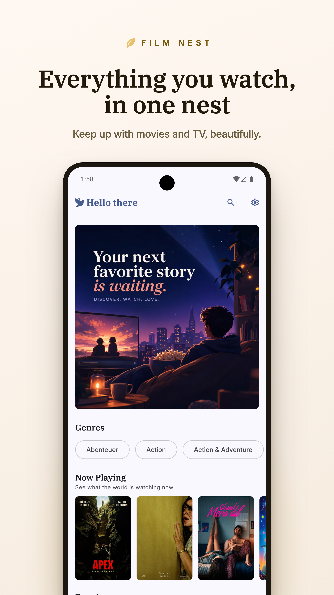
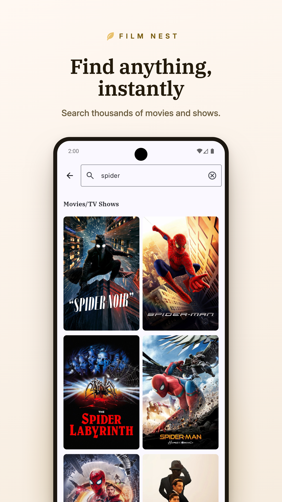
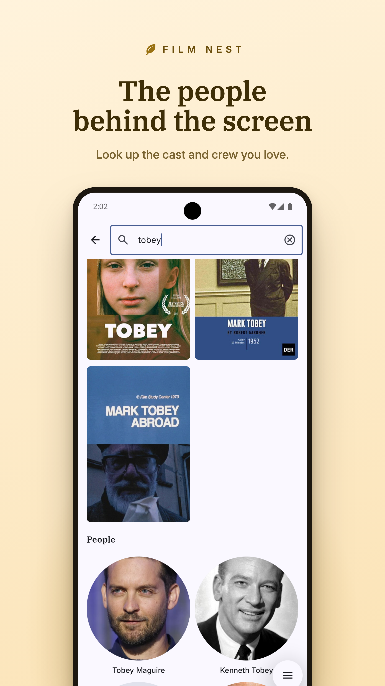
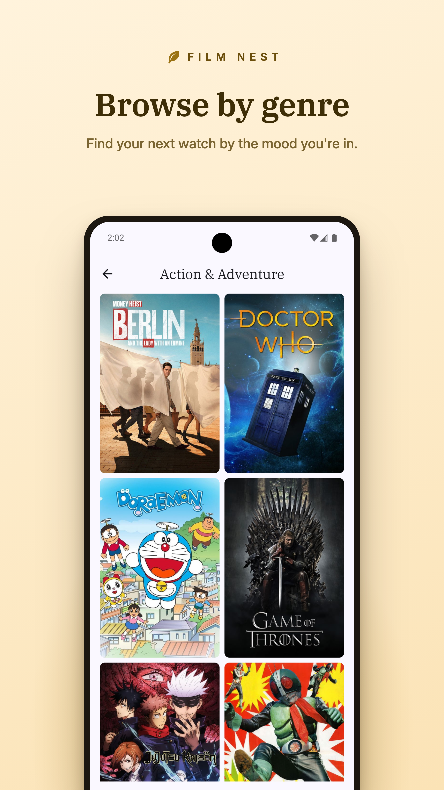
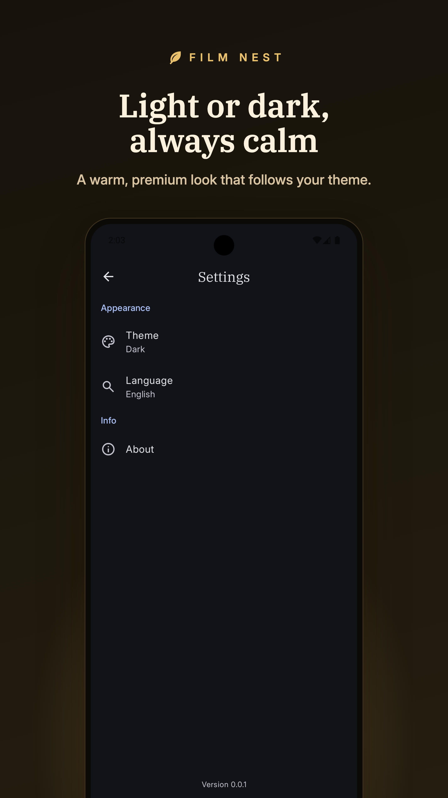
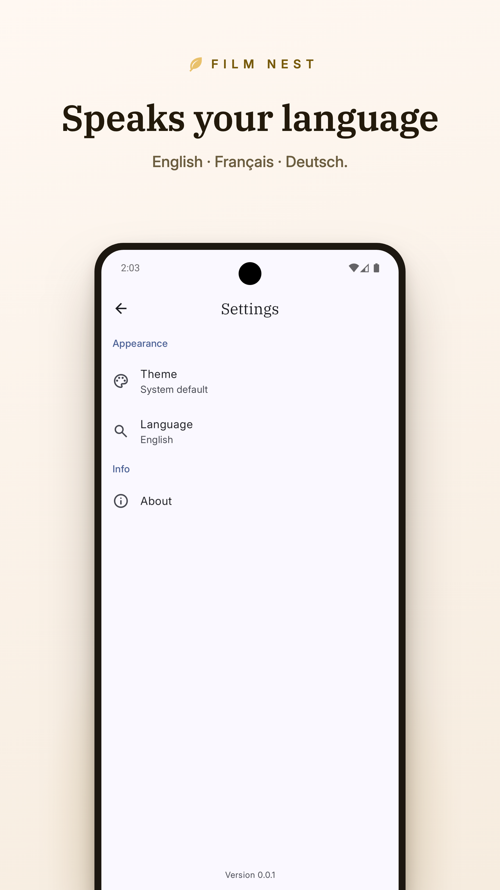

  

<h1 style="text-align: center">Film Nest</h1>

<table>
  <tr>
    <td style="padding: 0"></td>
    <td style="padding: 0"></td>
    <td style="padding: 0"></td>
    <td style="padding: 0"></td>
    <td style="padding: 0"></td>
    <td style="padding: 0"></td>
  </tr>
</table>

My first project built with the latest Android development and Kotlin APIs in mind.

Film Nest is a movie & TV discovery app powered by [The Movie Database](https://www.themoviedb.org/),
featuring a home feed, media details, genre browsing, multi-type search (movies, shows, and people),
a theme switcher, and multi-language support (English, French, German).

## 🧱 Tech stack

- **Kotlin** + **Jetpack Compose** (Material 3)
- **MVVM** with `StateFlow`-driven UI state
- **Coroutines & Flow** for async work and reactive streams
- **Hilt** for dependency injection
- **Retrofit** + **OkHttp** for networking
- **Coil** for image loading
- **Jetpack DataStore** for preferences
- **Compose Navigation** (type-safe routes)
- **MockK**, **Turbine**, **Robolectric**, **JUnit** for testing

## 📖 What I learned in this project

### Architecture & MVVM

- **MVVM with unidirectional data flow** — state flows down (ViewModel → UI), events flow up (UI → ViewModel functions).
- **`sealed interface` for UI state** — `Loading`/`Success`/`Error` make impossible states unrepresentable and force exhaustive `when` handling.
- **Repository pattern** — repositories own the mapping between the API and the rest of the app.
- **DTO vs domain model separation** — DTOs mirror raw JSON; clean app-facing models are mapped at the repository boundary so the API layer never leaks into the UI.
- **`SavedStateHandle` for route args** — lets a ViewModel read navigation arguments without breaking Hilt's DI graph.
- **The `_private`/`public` convention** — mutable `MutableStateFlow`/`Channel` stay private; read-only views are exposed.

### Coroutines & Flow

- **`viewModelScope`** — coroutines auto-cancel when the ViewModel is cleared.
- **`coroutineScope` vs `supervisorScope`** — all-or-nothing failure vs independent children.
- **Structured concurrency gotcha** — `try/catch` must wrap `coroutineScope`, not sit inside it, because it rethrows at its own boundary.
- **`StateFlow` vs `SharedFlow` vs `Channel`** — persistent state vs broadcast vs one-time events.
- **`Channel` for one-time events** — toasts/snackbars fire once and don't replay on rotation, unlike `StateFlow`.
- **Debounced search pipeline** — `debounce` + `distinctUntilChanged` + `flatMapLatest` to cancel stale in-flight searches.
- **`stateIn` with `WhileSubscribed`** — converts a cold Flow into a hot `StateFlow` that's alive only when observed.

### Jetpack Compose UI

- **`remember` & recomposition** — state resets without `remember`; survives recomposition with it.
- **`derivedStateOf`** — efficient scroll-driven state (the sticky, fading back button on the details screen).
- **`animateColorAsState`** — smooth color transitions on scroll.
- **`LazyVerticalGrid` mechanics** — rows size to the tallest item; full-span headers via `GridItemSpan(maxLineSpan)`.
- **Sectioned layouts** — partitioning mixed data so each grid row is homogeneous.
- **Window insets** — `statusBarsPadding()` to keep content in the safe area.
- **`PullToRefreshBox`** with a separate `isRefreshing` flag so content stays visible during refresh.

### Navigation

- **Type-safe routes** with `@Serializable` data classes/objects.
- **Passing arguments** — passing an ID rather than a whole object (freshness, deep links, Bundle limits).
- **Serializable enums** — custom route-param types like `MediaType` need `@Serializable`.

### Dependency Injection (Hilt)

- **`@Inject constructor`**, **`@HiltViewModel`**, and **`@AndroidEntryPoint`** wire classes, ViewModels, and Activities into the graph.
- **Hilt modules** — providing types Hilt can't construct itself (Retrofit, DataStore).

### Networking & Persistence

- **Retrofit + OkHttp interceptors** — injecting `api_key` and `language` into every request in one place.
- **`BuildConfig` fields** — pulling config from `local.properties` at build time.
- **Jetpack DataStore** — reactive, Flow-based preference storage for the theme.

### Testing

- **MockK** — `coEvery`/`coVerify` for suspend functions; re-stubbing mid-test.
- **Turbine** — asserting on Flow emissions (`awaitItem`, `expectMostRecentItem`, `expectNoEvents`).
- **`Dispatchers.setMain` + test dispatchers** — `UnconfinedTestDispatcher` (eager) vs `StandardTestDispatcher` (virtual-time control with `advanceTimeBy`).
- **Robolectric** — running unit tests that touch the Android framework (`SavedStateHandle`/`Bundle`).
- **Testing a debounce** — using `advanceTimeBy` to prove only the final query in a rapid sequence fires.
- **StateFlow conflation in tests** — equal consecutive values aren't re-emitted.
- **Tests catching real bugs** — a failing test surfaced a misplaced `try/catch` around `coroutineScope`.

### Localization

- **Per-app locales (AppCompat)** — `AppCompatDelegate.setApplicationLocales` as a single source of truth.
- **Resource qualifiers** — `values-fr`/`values-de` and Android's automatic resolution (and that Japanese is `ja`, not `jp`).
- **Localizing API content** — feeding the chosen locale to TMDB via the OkHttp interceptor.
- **Translation nuance** — keeping proper nouns/jargon untranslated and escaping apostrophes inside CDATA.

### Tooling & polish

- **Adaptive resources** — `drawable-night`, splash-screen theming, and vector drawable viewports.
